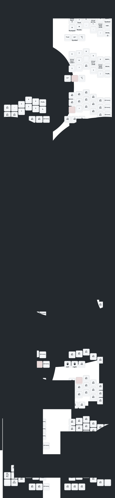

# Walkthrough - Keyboard Drawer Fixes

I have fixed the keyboard drawer output in the `Justfile` and updated the supporting scripts to ensure the Crosses keyboard diagrams are generated correctly.

## Changes Made

### 1. Justfile Updates
- Updated the `test-layouts`, `draw-crosses`, and `draw` recipes to use `config/crosses_shared.dtsi` instead of the non-existent `config/crosses.keymap`.
- Added a `sed` patch to the `draw-crosses` recipe to correctly map the `crosses-42-full` keyboard name to `gggw_crosses_42_layout`, ensuring `keymap-drawer` can find the information it needs in `crosses-info.json`.

### 2. Extractor Script Enhancements
- Updated `zmk_keymap_extractor.py` to include missing layer definitions (`MOUSE_SNIPE`, `MOUSE_HYPR`, `BTOOTH`, `SYS`).
- Added `MouseHypr` to the `layer_order` to ensure all layers are drawn.
- **Fixed Macro Recognition**: Improved the regex in the extractor to correctly detect `#define` statements without values (like `REAL_POINTING_DEVICE`).

## Verification Results

### Automated Tests
- Ran `just draw` which now successfully generates diagrams for both Corne and Crosses.

### Layer Verification
- **Crosses**: Confirmed that `REAL_POINTING_DEVICE` is detected. The `Mouse` layer now correctly renders trackball specific bindings (e.g., mouse buttons on the left hand) instead of emulated movement keys.
- **Corne**: Confirmed that `REAL_POINTING_DEVICE` is NOT detected. The `Mouse` layer correctly renders emulated movement keys (`mmv MOVE_LEFT`, etc.).

```bash
Found Base layer in content
Layers extracted: ['name', 'Base', 'Symbol', 'Numpad', 'Motion', 'Text', 'Media', 'Desktop', 'Function', 'Mouse', 'MouseSnipe', 'MouseHypr', 'System']
Generated build/keymaps/crosses-42-full.keymap with 13 layers
✓ Generated build/diagrams/crosses-42-full.svg
✓ Updated keymap-drawer/crosses-42-full.svg
✓ Updated keymap-drawer/crosses-42.svg
✓ Crosses diagram generated successfully
```

### Visual Verification
The generated SVG files are now updated in the `keymap-drawer/` directory.


